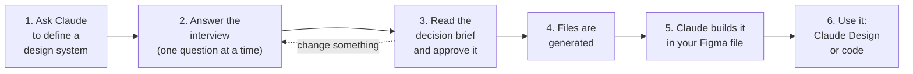

# How to use the Design System Definer

**In one sentence:** you tell Claude about your brand, Claude asks the right questions, you approve a one-page summary, and it builds an accessible set of design tokens into any Figma file.

You do not need to know design-token theory. Claude guides you; the skill makes sure nothing fails accessibility and nothing has to be rebuilt later.

## The workflow at a glance



| Step | You | Claude | You end up with |
| --- | --- | --- | --- |
| 1 | Say: *"Help me define a design system."* | Starts the skill, asks Guided or Express | |
| 2 | Answer questions about your brand | Asks one question at a time, with a reason and an example; challenges vague words like "premium" | A saved `ds.config.yaml` |
| 3 | Read the brief, say "approve" or request changes | Prints the decision brief: every decision with its reason, every brand colour checked | **Nothing is written until you approve** |
| 4 | Nothing | Generates the files | A `ds-out/` folder (see below) |
| 5 | Paste a Figma file link, review at each checkpoint | Runs the build scripts in your file, phase by phase | Variables, modes and text styles in Figma |
| 6 | Download the `.fig` into Claude Design, or use the code tokens | | A system that is ready to use |

## Before you start

| You need | For | Required? |
| --- | --- | --- |
| Claude Code, or claude.ai / Claude Desktop with the skill installed (see [README](../README.md#install)) | Steps 1 to 4 | Yes |
| The **Figma connector** in Claude, and edit access to a Figma file | Step 5 | Only to build in Figma |
| Your brand colours as hex, and fonts, if you have them | Step 2 | No. Claude can help you decide |

## Step by step

### 1. Start
Open Claude in your project folder and say:

> Help me define a design system.

Claude asks whether you want **Guided** (default, one question at a time) or **Express** (you already have a brand guide or colours to paste), and whether this is your first design system. Say yes to the second and Claude explains more; say no and it keeps things brief.

### 2. The interview
Seven short stages. Each question comes with *why it matters* and an example answer:

1. **Context.** What type of system is it? One brand, several brands, light and dark, and so on.
2. **Brand essence.** Three words per brand, and one thing it must never feel like.
3. **Levers.** Claude turns your words into design decisions (colour, type, shape, spacing) and you accept, edit or reject each.
4. **Variation.** What changes independently: brand, theme, device. Claude shows the resulting structure. For several brands it asks once whether to include a neutral **Base** mode.
5. **Anchors.** Your brand colours and fonts. Claude warns you now if a colour can't carry white text.
6. **Constraints.** Contrast level (AA, AAA or your own), touch target size, spacing unit.
7. **Playback.** The decision brief (next step).

A taste of how it sounds:

> **Claude:** You said "premium". Premium like restraint and whitespace, or like rich materials and depth? *(This decides how much colour the page carries.)*
> **You:** Restraint and whitespace.
> **Claude:** Then I'd keep neutrals dominant, use your brand colour sparingly, and pick small radii. Accept, edit, or reject?

Answers are saved to `ds.config.yaml` as you go, so you can stop and resume later.

### 3. Approve the decision brief
Claude shows a one-page brief: the structure (collections and modes), every decision with its reason, each brand colour and where it lands, and an accessibility summary ("124 pairs checked, 0 failing").

Want a change? Say so. Claude edits the config and shows the brief again. **Only when you say "approve" are files generated.**

### 4. What gets generated
Everything lands in `ds-out/`:

| File or folder | What it is | Who uses it |
| --- | --- | --- |
| `decision-brief.md` | The signed-off decisions | You, reviewers, interviews |
| `ds.config.yaml` | Your answers; edit one value and regenerate | You |
| `contrast-matrix.md` | Every text and UI colour pair in every mode, with its ratio | QA, documentation |
| `figma-build/*.js` | Scripts that create the variables in Figma | Claude (step 5) |
| `build-plan.md` | Phased Figma checklist with human checkpoints | You and Claude |
| `dtcg/` | The same tokens for code, plus a Style Dictionary config | Developers |
| `decision-records/` | One short record per key decision | Reviews |

### 5. Build it in Figma
Paste the link to the Figma file you want. Claude uses the Figma connector to run the scripts **in order**, then stops for your review:

1. **Foundations:** Primitives, Device, and Brand (or Theme) collections with all modes. *Checkpoint: you check the Variables panel.*
2. **Text styles**, bound to the variables. *Checkpoint.*
3. **Components** one at a time (button, text field, and so on) using Figma's `figma-generate-library` skill. *Checkpoint after each.*

### 5b. Already have screens? Bind them to the tokens
Add `bind` to `outputs:` in the config. The build then writes `figma-bind/`: scripts that attach your existing layers to the new text styles, colour variables, radius and spacing, rename default-named layers and add auto-layout where it is safe.

1. Save a named version in Figma first.
2. **Dry run** (the scripts default to it) and read the counts.
3. **Pilot one frame**, compare screenshots before and after.
4. Apply in batches, then run the read-only audit for measured coverage.

What it leaves alone, on purpose, is listed in [bind-existing-designs.md](../skills/defsys/references/bind-existing-designs.md). Changing the config later? Rebuild with `--previous <old build folder>` and run only `figma-build-delta/`.

### 6. Hand off
Download the `.fig` file and import it into Claude Design, or give developers the `dtcg/` folder.

## Does it work with any Figma file?

**Yes, any Figma Design file you can edit.** The skill never needs a particular file. The interview is independent of Figma; the Figma file is only where the result is built.

- **New or empty file (best):** everything is created from scratch.
- **File that already has variables:** the scripts match collections and variables **by name**. Same name means the value is updated; a new name means it is created. **Nothing is ever deleted**, so renamed tokens leave the old ones behind for you to remove.
- **Your own colour and font choices:** all come from your answers, not from the file. The interview does not infer a system from a file, but it can **read** one: for an existing file it runs a read-only inventory of the fonts, sizes, colours, radii and spacing in use and starts from that evidence. Nothing in the file changes until you approve and run the bind scripts.
- **Fonts:** the text-style script reports any font family that isn't available in the file so you can install or substitute it.

## Common questions

**Do I need Figma?** No. Steps 1 to 4 work without it, and the `dtcg/` tokens are usable in code. You need Figma only for step 5.

**Can I change one thing later?** Yes. Edit `ds.config.yaml` (for example `contrast: AAA`) and regenerate. The output is deterministic: the same config always gives the same files.

**What if a colour fails contrast?** Export is blocked and Claude shows the failing pair with a suggested fix. For light brand colours (like yellow) the skill keeps your exact hex as a token but builds the ramp so it passes, and pairs the colour with dark text.

**What can it model?** Brand, light/dark, device, platform (web, iOS, Android), density, accessibility variants (large text, reduced motion), locales and a product-versus-marketing type scale, in any combination, plus your own custom axes. **What can't it do?** Per-script line heights, and anything that needs arithmetic between modes (Figma variables have none). Claude says so when you hit one.

**Is anything sent anywhere?** The generator runs on your machine. The Figma scripts run in your Figma file through the connector you authorised.

**Can I skip Claude?** Yes, with Python 3.8+:

```bash
cd skills/defsys
python scripts/build.py my.config.yaml                      # prints the brief; writes nothing
python scripts/build.py my.config.yaml --approve --out ds-out
```

## Quick reference

| I want to | Do this |
| --- | --- |
| Start | "Help me define a design system" |
| Skip the interview | Say you have a brand guide or paste colours (Express mode) |
| See the plan without generating | Ask for the decision brief |
| Approve | Say "approve" after reading the brief |
| Change a decision | Tell Claude, or edit `ds.config.yaml`, then regenerate |
| Build in Figma | Give Claude the Figma file link after step 4 |
